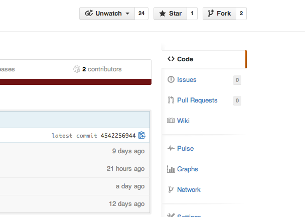
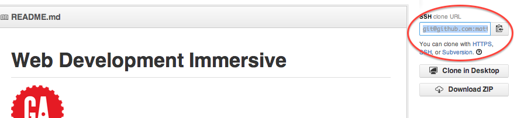
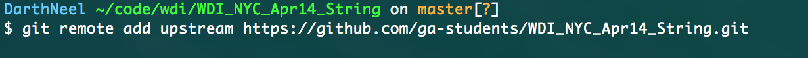

# Fork the repo: 
1.  Go to [https://github.com/ga-students/WDI_NYC_Apr14_String](https://github.com/ga-students/WDI_NYC_Apr14_String)
2.  Click the 'fork' button: 
 
 
---

# Clone the repo:
Now we will 'clone' this remote repository to our local machine. 

1.  Copy the 'SSH clone url' on the right hand side.

2. 	On your machine and in a bash shell, navigate to your `~/code/wdi` directory.  Run the following command: `git clone <your unique SSH clone url>`.  

3.  Here is the resulting file structure that you should have on your local machine 
	- code
		- wdi
			- personal
			- project
			- WDI_NYC_Apr14_String 

# Add a remote: 
1.  On your machine, in a bash shell, and in your `~/code/wdi` directory, run the following command: `git remote add upstream https://github.com/ga-students/WDI_NYC_Apr14_String.git`.  

---
# Rejoice!